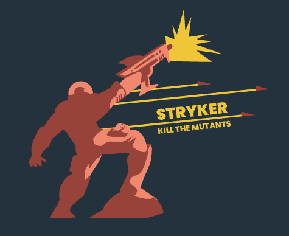
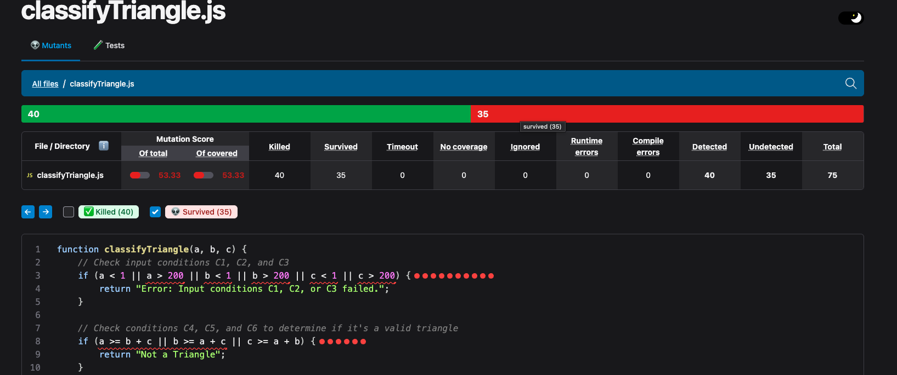

# CIS-602-Stryker-Example
This repository contains an example of the Mutation Testing topic using the Stryker Library.



## Setting up the system

### 1- Install Stryker in the repo
It is common to start this process by installing the library to the project under study.

```bash
npm install
npm install --save-dev @stryker-mutator/core @stryker-mutator/jest-runner
npm init stryker@latest
```

Then we need to run:

```bash
npx stryker run
```

### 2- Set up the configuration

Open the `package.json` file and add the settings below to it the `scripts` object:

``` json
    "scripts": {
            "test": "rm -rf .stryker-tmp/* && jest", 
            "reset": "jest --clearCache",
            "mutation": "rm -rf .stryker-tmp/* && stryker run --reporters html"
}

```

this line metions that when running:

```npm run mutation```

Stryker will run mutate test on the jest test cases.

`rm -rf .stryker-tmp/*` cleans old mutation artifacts (VERY useful in class)
`jest` runs tests normally --reporters html gives you a nice visual report (great for slides/demo)

### 3- Run the mutaion test

First let's start with running the tests:

```bash
npm test
```

Then next step is testing the resistance of the test cases vs mutation testing:

```bash 
npm run mutation
```

## What happens during mutation testing?

- Stryker takes the source file  `classifyTriangle.js`

- It generates multiple mutants, for example:
```js
>= → >
=== → !==
&& → ||
```

### For each mutant:

- Stryker runs the test suite using Jest
- Observes whether tests fail or pass

### What are the results like

The full output of the mutation testing is inside the reports folder. It visually shows the places which the test cases were not killed.

